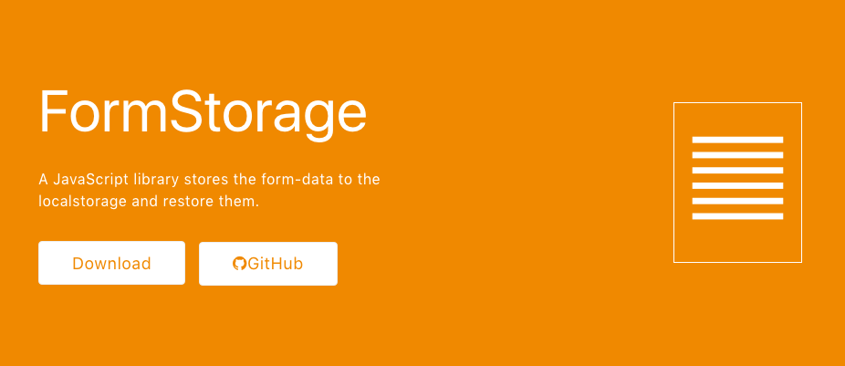

# form-storage

A JavaScript library stores the form-data to the localstorage so you don't have to fill the form again.



## Installation

### via npm

```sh
npm install form-storage --save
```

### via yarn

```sh
yarn add form-storage
```

### via cdn

```html
<script src="https://unpkg.com/form-storage@1.2.0/build/form-storage.js"></script>
```

## Usage

When using Browserify or Webpack.
```js
import FormStorage from 'form-storage';
```

When you don't want to remember some fields, then you can specify the selectors like below.

```js
const formStorage = new FormStorage('.js-form', {
  name: 'form-basic', // you can decide local-storage name 
  ignores: [
  '[type="hidden"]',
  '[name="policy"]'
  ]
});
// apply storaged data to the form.
formStorage.apply();
// save the form data to the storage.
formStorage.save();
```

When you just want to remember 'user-name' and 'user-email'

```js
const formStorage = new FormStorage('.js-form', {
  name: 'form-basic',
  includes: [
  '[name="user-name"]',
  '[name="user-email"]'
  ]
});
```